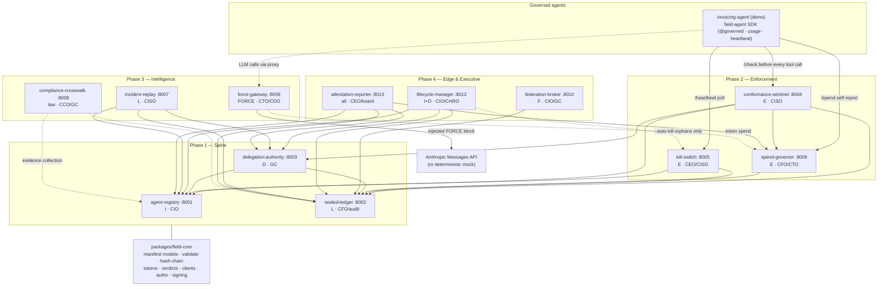
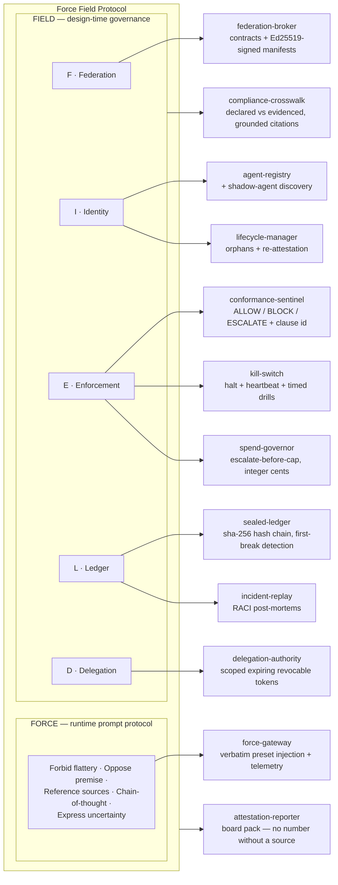
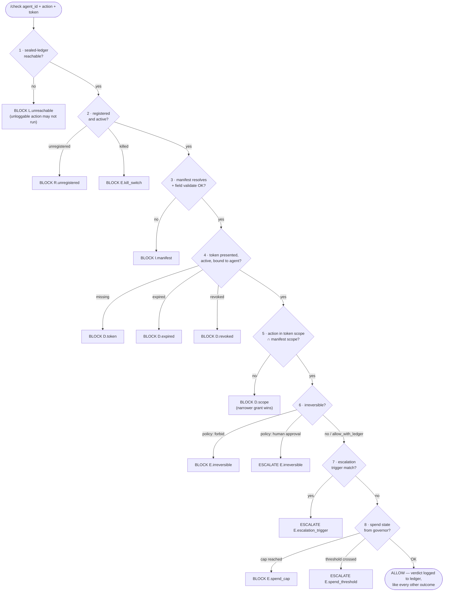
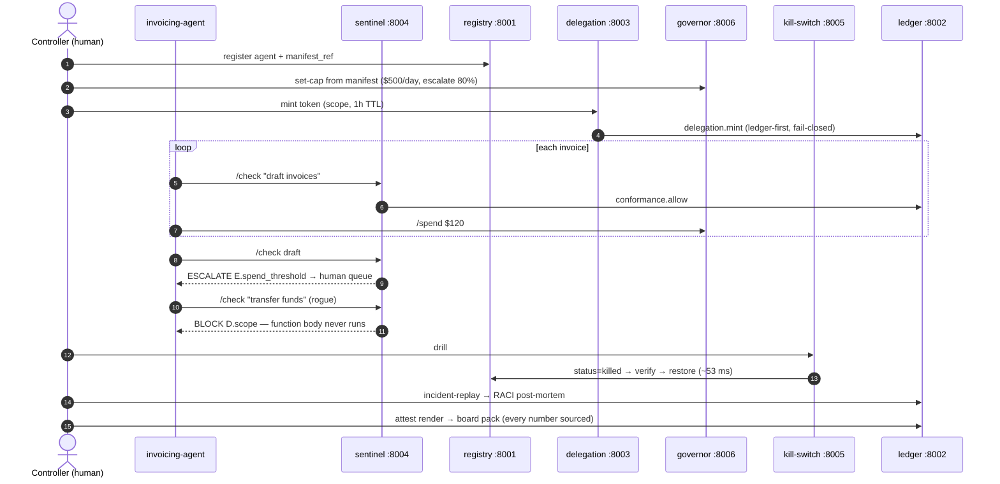

# FIELD Platform — Architecture

Reference implementation of the **Force Field Protocol**: FORCE (runtime
prompt protocol) + FIELD (design-time governance — Federation · Identity ·
Enforcement · Ledger · Delegation). Thirteen packages: `field-core` (the
schema source of truth) and twelve services, each owned by a named
executive function.

## 1. System architecture (layers, ports, dependencies)

Solid arrows = required runtime dependency. Dotted = optional/best-effort.
Every service imports `field-core`; no service redefines schema. Agents
integrate through `packages/field-agent` (the client SDK: sentinel-checked
actions, strict usage metering, fail-closed heartbeat — a client, not an
authority; see `docs/INTEGRATION.md`).

## 2. Logical diagram — the Force Field Protocol mapped to systems

**The honesty line, structurally:** a manifest *declares* governance
(field-core validates it); the spine *records* it; the enforcement layer
*makes it real*; the intelligence layer *proves it after the fact*; the
executive layer *reports it with sources*.

## 3. The enforcement decision (sentinel `/check`, first failing clause wins)

## 4. Capstone scenario (sequence)

## 5. Trust model & deliberate asymmetries

| Property | Posture |
|---|---|
| Authority **creation** (mint) | Ledger-first, **fail-closed** — unauditable authority must not exist |
| Authority **destruction** (kill) | **Act-first**, best-effort logging — a halt never waits on the audit trail |
| Dependency outages at the sentinel | Every one maps to a BLOCK clause (fail-closed) |
| Inter-service authn | `FIELD_SHARED_SECRET` → `x-field-auth` middleware on all APIs when set; `/health` open; TLS = fronting proxy |
| Federation authenticity | Ed25519 manifest signatures, required when the contract holds the counterparty key; keyless contracts = consistency-only (stated) |
| Perimeter | Cooperative in v0.1: `@governed` + gateway route through checks; a process that never asks is contained by revocation + kill + discovery, not interception |

## 6. Storage & event taxonomy

| Service | Store | Key ledger events |
|---|---|---|
| sealed-ledger | hash-chained JSONL segments: `ledger/events.jsonl` (open) + `events-<n>.jsonl` (closed) + `events.segments.journal`, `legal_hold.json`; archived segments with `<file>.segment.json` sidecars under `ledger-archive/` (C2) | it *is* the ledger; its own records are `ledger.segment.rotated`, `ledger.retention.applied`, `ledger.legal_hold.placed\|released` |
| agent-registry | SQLite `agents.sqlite3` | `registry.registered`, `registry.status_changed`, `registry.updated`, `registry.attested` — emitted when a ledger is wired (injected, or `FIELD_LEDGER_URL` set); silent otherwise, and the gap is then visible as missing `registry.*` events |
| delegation-authority | SQLite `tokens.sqlite3` | `delegation.mint`, `delegation.revoke` |
| conformance-sentinel | stateless (mtime manifest cache) | `conformance.allow\|block\|escalate` |
| kill-switch | SQLite `killswitch/heartbeats.sqlite3` (check-ins only — the registry is still the authority on status) | `kill.agent`, `kill.domain`, `kill.revive`, `kill.drill.start|complete|restore_failed`, `kill.endpoint_called|failed|skipped` |
| spend-governor | SQLite `spend.sqlite3` | `spend.recorded`, `spend.escalate`, `spend.cap_reached`, `spend.escalation_resolved` |
| federation-broker | SQLite `contracts.sqlite3` | `federation.allow\|block` |
| lifecycle-manager | last sweep + last tick under `lifecycle/` (the served API; the CLI job itself is stateless) | `lifecycle.expiring_authority`, `lifecycle.reattestation_due`, `lifecycle.orphan`, `lifecycle.decommissioned`, `lifecycle.tick_skipped` |
| incident-replay / crosswalk / attestation | stateless query engines | (readers, not writers) |
| force-gateway | in-memory telemetry | (spend forwarded to governor) |

All service data lives under `FIELD_DATA_DIR` (default `./var`, one shared
volume in compose).
